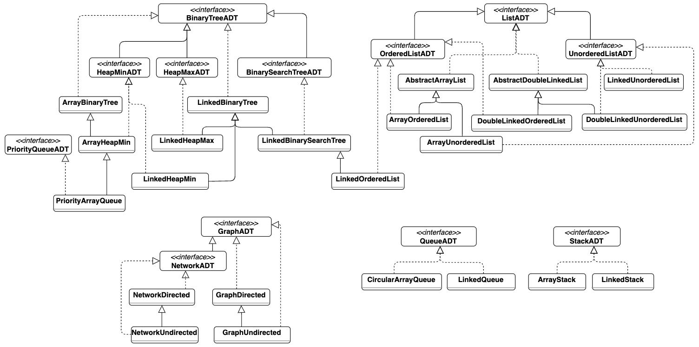

# Data Structures and Sorting Algorithms in Java

This project contains a collection of data structures as well as sorting and searching algorithms implemented in `Java`.

This was developed from scratch, without the use of any external libraries or packages. Only used the `Iterator` interface from the `java.util` package to implement the iterator pattern, as it provides a standard way of iterating over collections. 

##### Minimalist Class Diagram

## Data Structures

- [Graph](/src/main/java/com/example/graph), implemented with linked lists
    - [Network Directed](/src/main/java/com/example/graph/NetworkDirected.java) with  [Dijkstra's](/src/main/java/com/example/graph/NetworkDirected.java#L206-L261) for shortest path
    - [Network Undirected](/src/main/java/com/example/graph/NetworkUndirected.java)
    - [Graph Directed](/src/main/java/com/example/graph/GraphDirected.java)
    - [Graph Undirected](/src/main/java/com/example/graph/GraphUndirected.java)
- [Binary Search Tree](/src/main/java/com/example/binaryTree/LinkedBinarySearchTree.java) (AVL Tree)
- Heap
    - [Linked Min Heap](/src/main/java/com/example/binaryTree/LinkedHeapMin.java)
    - [Linked Max Heap](/src/main/java/com/example/binaryTree/LinkedHeapMax.java)
    - [Array Min Heap](/src/main/java/com/example/arrayBinaryTree/ArrayHeapMin.java)
- List, with [Iterator](/src/main/java/com/example/list/LinkedUnorderedList.java#L250-L289) pattern implemented 
    - [Linked Ordered List](/src/main/java/com/example/list/LinkedOrderedList.java)
    - [Linked Unordered List](/src/main/java/com/example/list/LinkedUnorderedList.java)
    - [Double Linked Ordered List](/src/main/java/com/example/doubleLinkedList/DoubleLinkedOrderedList.java)
    - [Double Linked Unordered List](/src/main/java/com/example/doubleLinkedList/DoubleLinkedUnorderedList.java)
    - [Array Ordered List](/src/main/java/com/example/arrayList/ArrayOrderedList.java)
    - [Array Unordered List](/src/main/java/com/example/arrayList/ArrayUnorderedList.java)
- Queue
    - [Priority Queue](/src/main/java/com/example/arrayBinaryTree/PriorityArrayQueue.java)
    - [Circular Array Queue](/src/main/java/com/example/arrayQueue/CircularArrayQueue.java)
    - [Linked Queue](/src/main/java/com/example/queue/LinkedQueue.java)
- Stack
    - [Linked Stack](/src/main/java/com/example/stack/LinkedStack.java)
    - [Array Stack](/src/main/java/com/example/arrayStack/ArrayStack.java)

## Sorting Algorithms

- [Quick sort](/src/main/java/com/example/sortingAndSearching/Sorting.java#L70-L125)
- [Merge sort](/src/main/java/com/example/sortingAndSearching/Sorting.java#L127-L182)
- [Heap sort](/src/main/java/com/example/sortingAndSearching/Sorting.java#L184-L232)
- [Bubble sort](/src/main/java/com/example/sortingAndSearching/Sorting.java#L49-L68)
- [Insertion sort](/src/main/java/com/example/sortingAndSearching/Sorting.java#L30-L47)
- [Selection sort](/src/main/java/com/example/sortingAndSearching/Sorting.java#L8-L28)

## Searching Algorithms

- [Linear Search](/src/main/java/com/example/sortingAndSearching/Searching.java#L6-L20)
- [Binary Search](/src/main/java/com/example/sortingAndSearching/Searching.java#L22-L59)
- [Depth First Search](/src/main/java/com/example/graph/NetworkDirected.java#L157-L193)
- [Breadth First Search](/src/main/java/com/example/graph/NetworkDirected.java#L288-L317)

